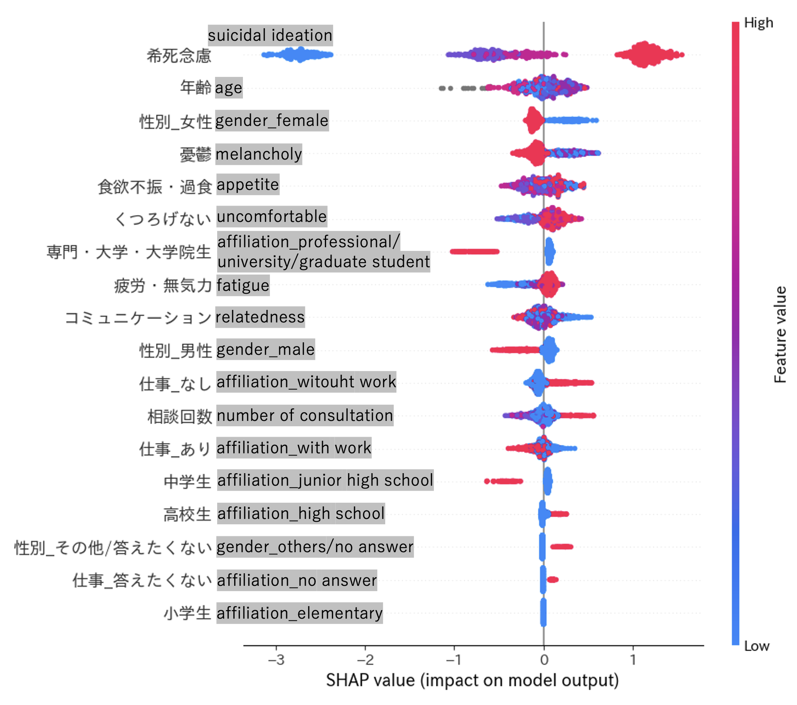
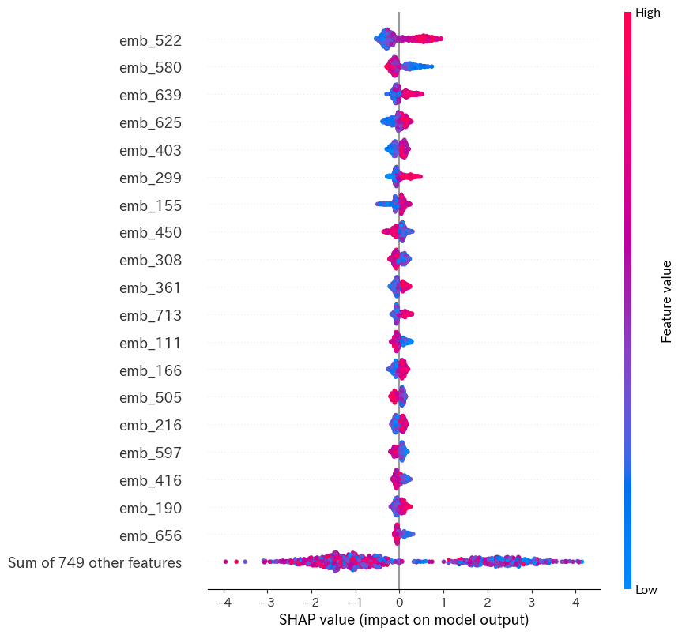
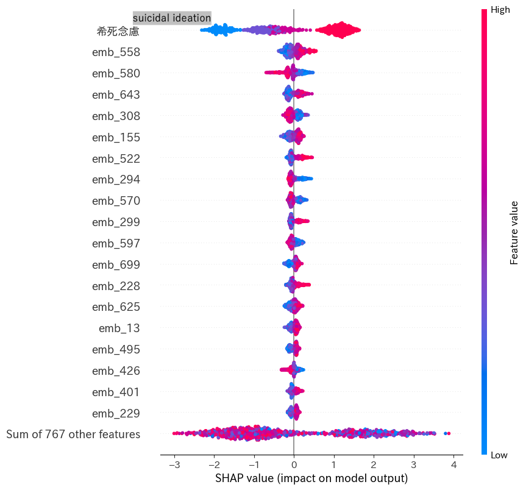
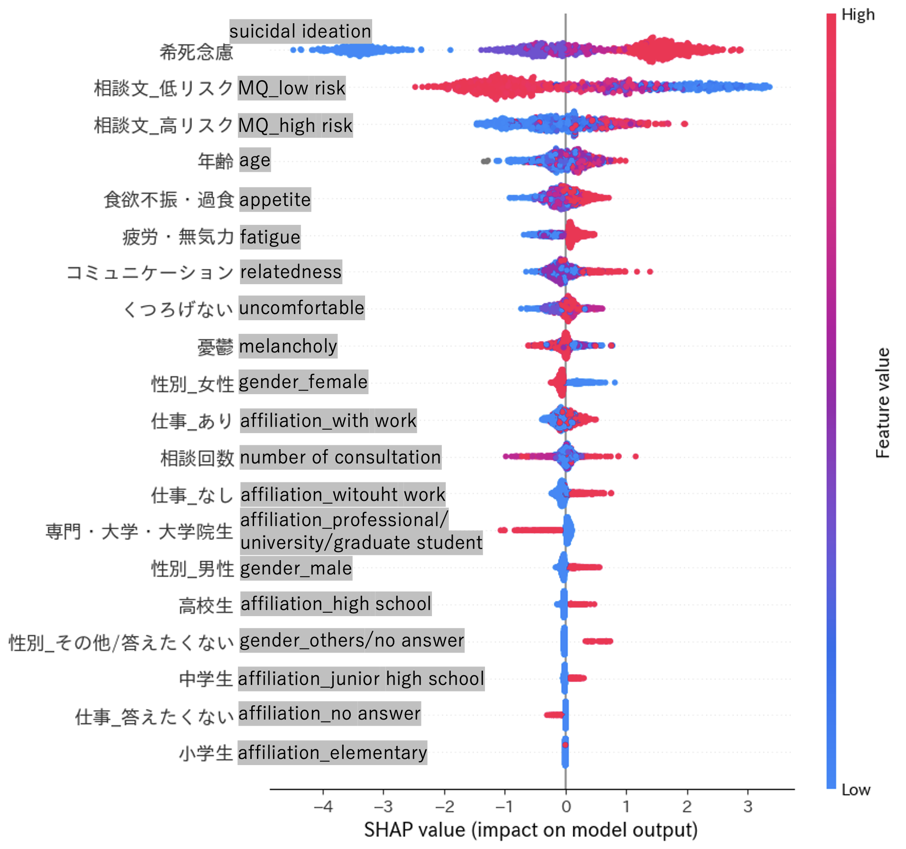
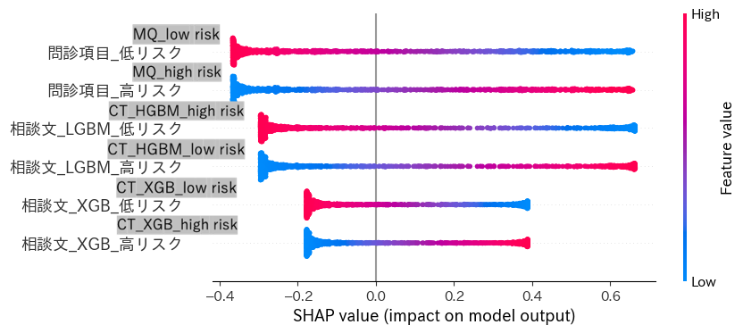
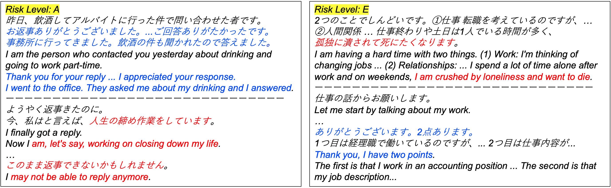

# Predicting-Suicide-Risk-in-SNS-Counseling

**Authors:** Ryota Ogasawara, Takeshi Imai, Kazuyoshi Takeda and Kazuyuki Nakagome

This repository provides supplementary materials for the paper "Machine-Learning-Based Prediction of Suicide Risk Using Preliminary Questionnaire and Consultation Text". It includes additional figures and their corresponding descriptions that were not included in the main paper due to space constraints.

## Files

* **fig/**: Contains all supplementary figures.

## 4. _Discussion_

### 4.1 _Interpretability for Each Method_

Figure 2-1. SHAP beeswarm plots for M1-MQ (Medical Questionnaire).

Figure 2-2. SHAP beeswarm plots for M1-CT (Consultation Text). The feature named "emb_n" indicates the _n_-th component in the embedding.

Figure 2-3. SHAP beeswarm plots for M1-MQCT.

Figure 2-4. SHAP beeswarm plots for M2.

Figure 2-5. SHAP beeswarm plots for M3.

[!TIP] Considering actual use in the consultation, for use cases where the SHAP values in each case are referenced along with the preliminary information (i.e., MQ and CT), it may be better to use M2, which has high interpretability, even if its accuracy is slightly inferior.

### 4.2 _Error Analysis_

Figure 3. Misclassified case examples for the risk level A (left) and E (right). Red text is for negative expressions, blue text is for positive expressions.
